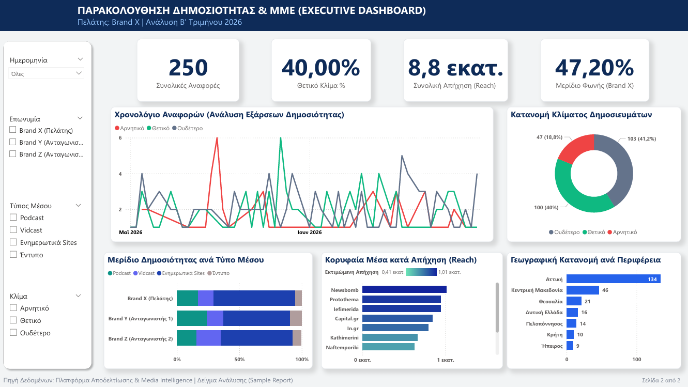

# Executive Media Intelligence & Publicity Dashboard

[](#)
[](#)
[](#)

A C-level Business Intelligence solution transforming fragmented media monitoring data into actionable, strategic insights. Designed as a standardized executive deliverable featuring automated narrative briefing and sentiment benchmarking.

---

## 📌 Business Overview & Problem Statement
Organizations monitoring media exposure often drown in unstructured article exports without clear visibility into public impact, sentiment exposure, or competitive positioning.

This solution delivers an end-to-end reporting framework consisting of:
1. **Strategic Narrative (Executive Briefing):** Qualitative briefing summarizing market share, sentiment balance, reach efficiency, and spikes.
2. **Interactive Visual Dashboard:** A centralized Power BI monitoring platform analyzing coverage velocity, media mix, and audience potential.

📄 **[Download the Full 2-Page Executive PDF Deliverable](./Executive_Media_Intelligence_Report.pdf)**

---

## 📊 Deliverables & Visual Showcase

### Page 1: Executive Briefing (Narrative & Benchmarking)
Provides senior leadership with clear takeaways without requiring manual dashboard navigation.
- **KPI Overview:** Client mentions, positive sentiment ratio, and total reach vs. competitors.
- **Narrative Analysis:** Structured executive commentary on Share of Voice, Spikes, and Channel penetration.
- **Competitive Benchmarking Table:** Clear comparative metrics (Mentions, Estimated Reach, Share of Voice %).

<p align="center">
  
</p>

---

### Page 2: Visual Dashboard (Power BI UI/UX)
Engineered for deep-dive exploratory analysis with an integrated slicer drawer and high-density visualizations.
- **Sentiment Timeline:** Daily frequency spikes segmented by sentiment polarity (Positive, Neutral, Negative).
- **Sentiment Breakdown:** Donut visual categorizing media tonality.
- **Media Reach & Mix:** Horizontal bar ranking top media outlets by estimated audience impact and cross-brand format distribution.
- **Geographic Distribution:** Concentration of coverage across administrative regions.

<p align="center">
  
</p>

---

## 🛠️ Technical Architecture & DAX Measures

### 1. Data Model
- **Fact Table:** Publicity mentions, publication dates, sentiment polarity, and reach estimations.
- **Dimension Tables:** Media Outlets, Outlets Type, Geography, and Brand Profiles.
- **Data Transformation (Power Query):** Cleaning raw platform exports, handling missing reach values, and standardizing outlet taxonomy.

### 2. Sample DAX Measures

#### Share of Voice (Mentions %)
```dax
Share of Voice % = 
VAR ClientMentions = CALCULATE(COUNTROWS('Fact_Media'), 'Dim_Brand'[Brand_Name] = "Brand X (Client)")
VAR TotalMarketMentions = COUNTROWS('Fact_Media')
RETURN
DIVIDE(ClientMentions, TotalMarketMentions, 0)
```

#### Sentiment Polarity Ratio
```dax
Positive Sentiment % = 
DIVIDE(
    CALCULATE(COUNTROWS('Fact_Media'), 'Fact_Media'[Sentiment] = "Positive"),
    COUNTROWS('Fact_Media'),
    0
)
```

#### Top Outlets by Estimated Reach
```dax
Total Reach = SUM('Fact_Media'[Estimated_Reach])
```

---

## 📂 Repository Deliverables
- `Executive-Briefing.png`: High-resolution narrative briefing preview.
- `Visual-Dashboard.png`: High-resolution BI dashboard preview.
- `Executive_Media_Intelligence_Report.pdf`: Full production-ready 2-page deliverable.

---

## 👤 Author
- **Role:** BI & Data Analyst
- **Specialization:** Executive Dashboarding, Power BI, DAX & Automated Reporting
